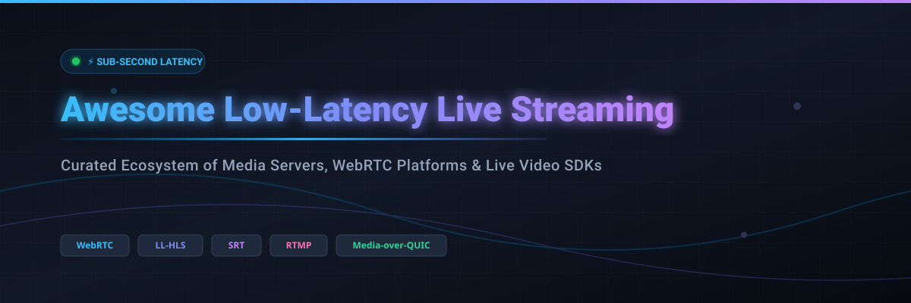

# ⚡ Awesome Low-Latency Live Video Streaming 📹

  
  
  
  
  
  

> **A curated, production-ready directory of Low-Latency Live Video Streaming SaaS platforms, self-hosted open-source media servers, WebRTC SFU gateways, and real-time interactive video SDKs.**

---

## 📌 Executive Summary & SEO Keywords

This repository serves as the definitive reference guide for video engineers, DevOps architects, and media software developers seeking **sub-second to ultra-low latency live video streaming infrastructure**. 

### 🔑 Key Topic Coverage:
- **Sub-Second Interactivity:** WebRTC, WebTransport, Media-over-QUIC (< 500 ms latency)
- **Large-Scale Low-Latency Broadcasting:** Low-Latency HLS (LL-HLS), Low-Latency DASH (LL-DASH), CMAF (~ 2 to 5 seconds latency)
- **Ingest & Contribution Protocols:** SRT (Secure Reliable Transport), RTMP, RTSP, RIST, WHIP, WHEP
- **Infrastructure Architectures:** Selective Forwarding Units (SFU), Multipoint Control Units (MCU), Media Routers, Adaptive Bitrate Transcoders (ABR), and Edge CDN Distribution.

---

## 📋 Table of Contents

- [📊 Sector Market Overview](#-sector-market-overview)
- [☁️ SaaS / Cloud Hosted Platforms](#%EF%B8%8F-saas--cloud-hosted-platforms)
- [🛠️ Open-Source GitHub Media Servers & WebRTC Platforms](#%EF%B8%8F-open-source-github-media-servers--webrtc-platforms)
- [🤝 How to Contribute](#-how-to-contribute)
- [💖 Support & Sponsorship](#-support--sponsorship)
- [📈 Star History](#-star-history)
- [⚖️ Disclaimer & Engineering Guidelines](#%EF%B8%8F-disclaimer--engineering-guidelines)

---

## 📊 Sector Market Overview

**Estimated Sector Market Size & Industry Dynamics:**  
The global low-latency live video streaming market is estimated at **$1.8B – $2.5B in 2026**, projected to reach **$6.5B+ by 2030** at a CAGR of ~21.5%. The market structure is **moderately fragmented** (rather than winner-take-all) due to distinct architectural trade-offs: hyperscale cloud providers focus on cost-effective LL-HLS broadcast delivery at scale, real-time API platforms specialize in sub-second WebRTC interactivity, and open-source media engines power self-hosted sovereignty.

---

## ☁️ SaaS / Cloud Hosted Platforms

> *Commercial cloud platforms sorted in descending order by estimated company size (annual revenue / valuation).*

| 🚀 Platform / Product | 🏢 Company Size (Revenue / Valuation) | 💰 Starting Tier Pricing | 🆓 Free Tier / Trial Quota | 🎯 Key Focus / Best For |
| :--- | :--- | :--- | :--- | :--- |
| **[Amazon Interactive Video Service (IVS)](https://aws.amazon.com/ivs/)** | ~$600B Revenue / ~$2.2T Market Cap *(AWS)* | $0.015/hr (ingest) + $0.075/hr (SD output) | 5 hrs live video input & 100 hrs output/mo free forever | AWS-native managed interactive streaming |
| **[Cloudflare Stream](https://www.cloudflare.com/products/stream/)** | ~$1.7B Revenue / ~$35B Market Cap *(Cloudflare)* | $5.00/mo (includes 1,000 min storage & 5,000 min view) | 10,000 minutes free trial credit (30-day trial) | Simple video delivery & low-latency HLS |
| **[Millicast (Dolby.io)](https://dolby.io/)** | ~$1.3B Revenue / ~$7.5B Market Cap *(Dolby Labs)* | $0.0055/GB transferred ($1.50/k participant mins) | $50 free credit on signup (valid forever) | Interactive WebRTC video & sub-second audio |
| **[Agora.io](https://www.agora.io/)** | ~$140M Revenue / ~$400M Market Cap *(Agora Inc.)* | $1.99 per 1,000 subscriber minutes (Audio/Video HD) | 10,000 free minutes per month (renews monthly forever) | Real-time engagement & social live streaming |
| **[Wowza Video](https://www.wowza.com/)** | ~$75M Revenue / ~$300M Valuation *(ClearLake Capital)* | $175.00/mo (includes 1,500 streaming hrs & 5 hr processing) | 30-day free trial (up to 1,000 peak connections / 10 hr processing) | Enterprise & broadcast-grade live streaming |
| **[Mux Video](https://mux.com/)** | ~$40M Revenue / ~$450M Valuation *(Series C)* | $0.04/min encoding + $0.0012/min delivery | $20 free trial credit (~500 encoding mins, valid indefinitely) | Developer-first video API & analytics |
| **[Livepeer](https://livepeer.org/)** | ~$300M FDV Market Cap / ~$5M Revenue *(Livepeer Studio)* | $0.005/min streaming ($0.003/min playback) | 1,000 streaming mins & 1,000 playback mins/mo free forever | Decentralized video streaming infrastructure |
| **[Phenix Real Time Solutions](https://phenixrts.com/)** | ~$15M Revenue / ~$90M Valuation *(Phenix RTS)* | $499.00/mo (Starter tier with 5,000 GB bandwidth) | 14-day free trial (up to 1,000 concurrent viewers & 50 GB bandwidth) | Ultra-low latency at broadcast scale |
| **[Red5 Pro](https://www.red5.net/)** | ~$8M Revenue / ~$30M Valuation *(Infrared5)* | $299.00/mo (Developer/Growth tier with autoscale clusters) | 30-day free trial (Developer license for 100 concurrent connections) | Interactive multi-party WebRTC streaming |
| **[Dyte](https://dyte.io/)** | ~$3M Revenue / ~$30M Valuation *(Y Combinator)* | $0.0015 per user-minute | 10,000 free user-minutes per month (renews monthly forever) | Developer-friendly live video & voice SDKs |

---

## 🛠️ Open-Source GitHub Media Servers & WebRTC Platforms

> *Repositories are sorted in descending order by GitHub_Stars_Count. Stars_Badges link directly to each repository's stargazers page.*

- **[OBS Studio](https://github.com/obsproject/obs-studio)**  — Free and open-source software for live video recording and live streaming.
- **[FFmpeg](https://github.com/FFmpeg/FFmpeg)**  — Foundational cross-platform multimedia framework to record, convert, transcode, and stream audio/video.
- **[Jitsi Meet](https://github.com/jitsi/jitsi-meet)**  — Secure, simple, and scalable WebRTC video conferencing standalone and embeddable application.
- **[SRS (Simple Realtime Server)](https://github.com/ossrs/srs)**  — High-performance, production-ready real-time media server supporting RTMP, WebRTC, HLS, HTTP-FLV, SRT, and MPEG-DASH.
- **[LiveKit](https://github.com/livekit/livekit)**  — Scalable, distributed WebRTC SFU stack written in Go for real-time video, audio, and AI applications.
- **[MediaMTX](https://github.com/bluenviron/mediamtx)**  — Ready-to-use zero-dependency live media server and proxy supporting Media-over-QUIC, SRT, WebRTC, RTSP, RTMP, and LL-HLS.
- **[Pion WebRTC](https://github.com/pion/webrtc)**  — Pure Go implementation of the WebRTC API for building low-latency custom media pipelines.
- **[coturn](https://github.com/coturn/coturn)**  — High-performance TURN/STUN server project essential for WebRTC NAT traversal and media relaying.
- **[Nginx-RTMP Module](https://github.com/arut/nginx-rtmp-module)**  — NGINX extension for RTMP live streaming, video publishing, and HLS/DASH output generation.
- **[Owncast](https://github.com/owncast/owncast)**  — Self-hosted single-user live video streaming server with built-in interactive web chat.
- **[Janus WebRTC Server](https://github.com/meetecho/janus-gateway)**  — General-purpose C-based WebRTC gateway supporting plugin architectures for VideoRoom, streaming, and SIP.
- **[mediasoup](https://github.com/versatica/mediasoup)**  — Cutting-edge WebRTC SFU library designed with a C++ core and Node.js/Rust signaling bindings.
- **[Node-Media-Server](https://github.com/illuspas/Node-Media-Server)**  — Node.js implementation of RTMP, HTTP-FLV, and WebSocket-FLV live media server.
- **[Restreamer](https://github.com/datarhei/restreamer)**  — Complete streaming server solution for self-hosting with a visual UI to ingest and multi-publish streams.
- **[Ant Media Server](https://github.com/ant-media/Ant-Media-Server)**  — Ultra-low latency streaming engine delivering ~0.5s WebRTC streams with auto-scaling and cross-platform SDKs.
- **[GStreamer](https://github.com/GStreamer/gstreamer)**  — Pipeline-based multimedia framework for constructing complex audio and video processing graphs.
- **[OvenMediaEngine](https://github.com/AirenSoft/OvenMediaEngine)**  — Sub-second latency live streaming server supporting WebRTC and LL-HLS with embedded ABR transcoding.
- **[Jitsi Videobridge](https://github.com/jitsi/jitsi-videobridge)**  — WebRTC-compatible Selective Forwarding Unit (SFU) router designed for high-concurrency video conferencing.
- **[Kurento Media Server](https://github.com/Kurento/kurento-media-server)**  — WebRTC media server offering media pipelines, computer vision capabilities, and real-time video filters.
- **[Shaka Packager](https://github.com/shaka-project/shaka-packager)**  — Media packaging framework for VOD and Live DASH/HLS applications supporting Common Encryption (CENC) and DRM.
- **[OpenVidu](https://github.com/OpenVidu/openvidu)**  — Self-hosted real-time video and audio application platform built on top of LiveKit and mediasoup.
- **[Membrane Framework](https://github.com/membraneframework/membrane_core)**  — Modular multimedia processing framework written in Elixir for building scalable audio/video pipelines.

---

## 🤝 How to Contribute

Contributions from video engineers, streaming architects, and developers are warmly welcomed! 🌟

1. 🍴 **Fork the repository** on GitHub.
2. 📝 **Add or edit entries** in `README.md` following the established tabular and list format.
3. ℹ️ **Provide clear factual details**: include protocol capabilities, pricing/tier details, and license types.
4. 🚀 **Submit a Pull Request (PR)** with a clear title and description.

Check out [Awesome-Awesome-Awesome](https://github.com/ishandutta2007/Awesome-Awesome-Awesome) for more curated tech repositories.

---

## 💖 Support & Sponsorship

Thank you for exploring and building with the low-latency live streaming community! 🌟

If you find this repository helpful, please consider supporting the project:
- ⭐ **Star this repository** to help others discover it!
- 🔀 **Fork & Share** it with fellow streaming engineers and developers.
- ☕ **Buy me a coffee / Sponsor**: If you'd like to support ongoing maintenance and new features, visit the [Sponsor Dashboard](https://github.com/sponsors/ishandutta2007).

---

## 📈 Star History

---

## ⚖️ Disclaimer & Engineering Guidelines

- **Community Curated:** This repository is a community-curated list for informational purposes.
- **Security & Infrastructure:** Self-hosted live media servers require proper security hardening (TURN/STUN auth, TLS encryption, IP whitelisting) and network bandwidth planning.
- **Latency vs. Scale Trade-offs:** WebRTC delivers sub-second latency (<500ms) but requires significant SFU relay capacity for massive concurrency; LL-HLS scales easily to millions of viewers with 2–5 seconds latency.
